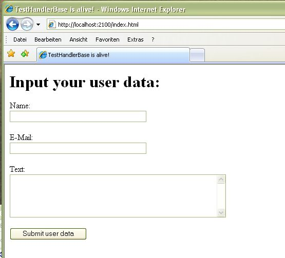
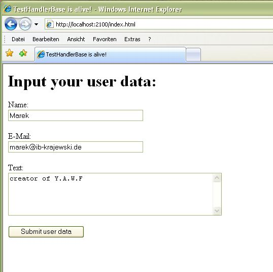
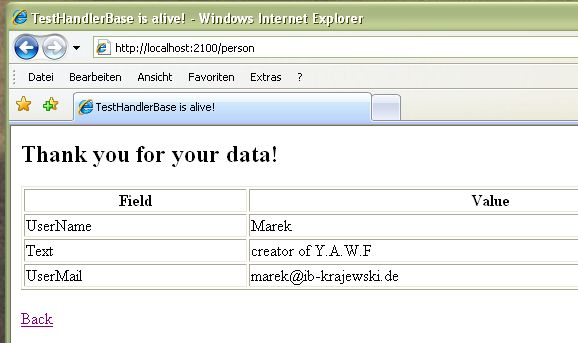

#    YAWF4q: a pluggable mini HTTP server & template engine for Qt-4 

Qt-only (no other dependencies) module to add a simple Web interface to your Qt application.
Uses Qt4. Tested on Windows. 

You'll need to set the *QTLIB* environment variable to compile the example Visual Studio project. 

When you start the example server you will see the following screen in the browser:



You can type in your data and submit it to the server:



And you will get a a response page like this:




## NOTE: 
+ this code works **only with Qt4** and **cannot be ported** to Qt5 because of removal of the HTTP parsing classes!!!
+ Qt Company is working on an embedded HTTP server module for Qt-5: https://github.com/qt-labs/qthttpserver, use it instead!
+ The template engine could be maybe reused in another project


## 1. Use it in your code like this:
```cpp
  #include "CuteHttpServer.hpp"

  int main(int argc, char* argv[])
  {
    // your application:
    QApplication* qtAppl = new QApplication(argc, argv);
    
    // the webserver on port 3100
    ibkrj::yawf4q::CuteHttpServer testServer(3100);
    std::string error;

    if(!testServer.start(error))
        return -1;
  
    // run Qt
    qtAppl->exec();
  }
```  
    
## 2. Use *Yawf4qConfig.txt* file to configure HTTP routing like this:
```      
    # YAWF test configuration
    index.html$ :: TestHandlerBase
    person$ :: TestHandlerPerson
```  
  
## 3. Your request handlers inherit the base handler class like this:

Warning: oldskool here!

```cpp
    class TestHandlerBase
        : public CuteHttpHandler
    {
    public:
        TestHandlerBase() 
            : CuteHttpHandler("TestHandlerBase") {}; // boilerplate

        // base overrides
        virtual CuteHttpHandler* clone() { return new TestHandlerBase; } // boilerplate
        virtual void process(CuteSrvRequest& reqData, std::string& respData)
        {
            // handle your request 
            // ... 
            
            // you may use a template for the response if you want:
            respData = CuteHttpHandler::renderThis(jsonDataMap, templateString);
        }

    } g_handler1;
```

That's all.

 **PS:** template magic is avoided as not to add a Boost dependency in here. If you don't mind that 
    just use cppnetlib instead! For more background, I wrote a blogpost here: http://ib-krajewski.blogspot.com/2010/11/yet-another-web-framework-in-c.html


------------------
## OPEN TODO:

- routing: dispatch to different methods of a handler class (design ready, just implement)
- read the templates from files
- cache parsed templates
- add config file parameter to CuteHttpServer's constructor
- add direct parametrization with on the fly handlers and  CuteHttpServer's constructor (???)
- run a memory leak tool over that!
- remove compiler warnings
- serious testing

and more:
- HTTPS support in the sever (that shouldn't be very difficult as Qt offers QSslSocket and other classes)
- configurable threading models: SINGLE_THREADED, THREAD_POOL, XXX???
- cookies and session data handling
- dynamic loading of the servlets via DLLs (kind of what ASP is doing)
